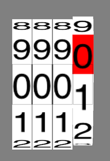

#Odometer

## A Mechanical Odometer using Core Animation in Swift

####It is created using a Decagonal prism, rotating it along it's axis using Core Animation and only showing the front. Simply copy `Odometer.swift` and `Rollview.swift` into your project and use as shown in `ViewController.swift`.

